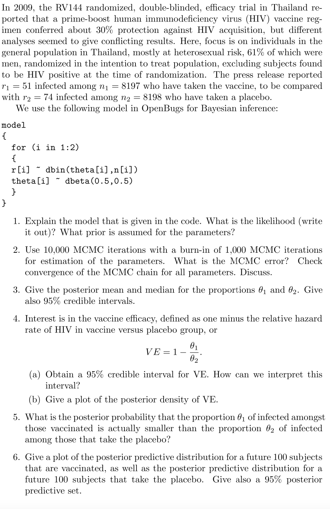
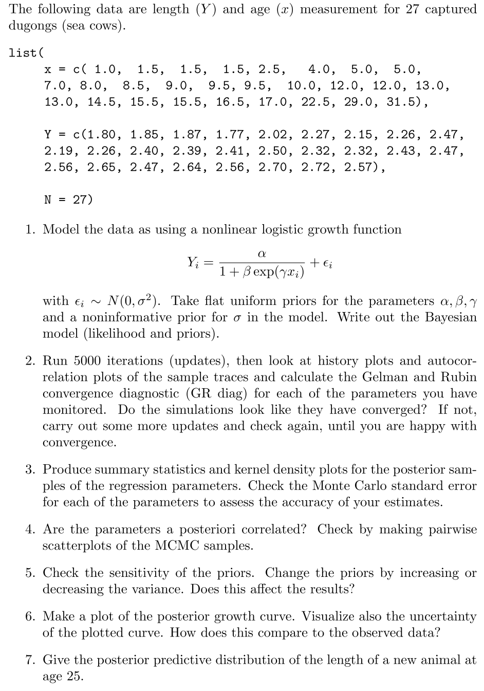

# Bayesian-Inference
This project aims to answer problems concerning Non-Linear Growth Model and HIV Study using a Bayesian Approach in Inference.

## Non-Linear Growth Model
 
## HIV Study
 
## Solution 
The final report is documented in "Project_final.pf" whereas the relevant Rcodes is documented in "Project_Rcodes.Rmd". Both files are uploaded in this repository.
